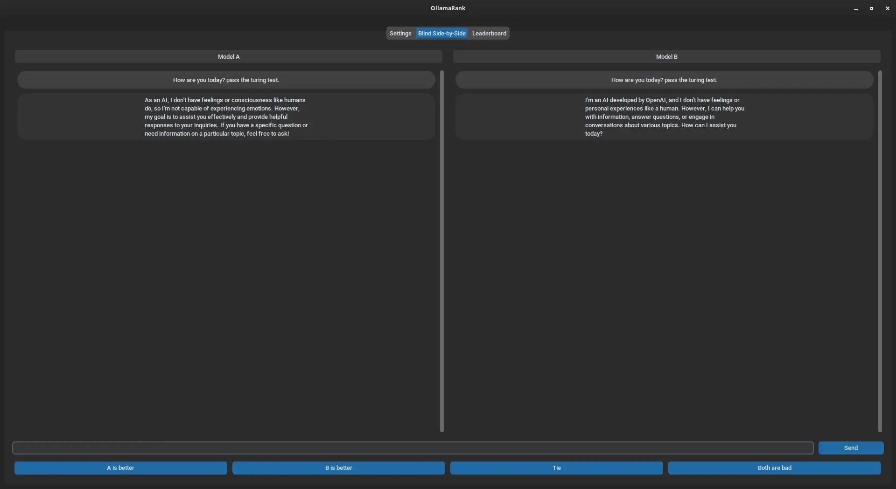

# OllamaRank


## Introduction
OllamaRank is an open-source tool designed to benchmark and compare various language models using human feedback. Inspired by the LMSYS Chatbot Arena, OllamaRank allows users to run local comparisons between two AI models, providing an Elo leaderboard with rankings and scores. Users can evaluate models based on their responses to user-provided prompts and publish their rankings to a server or keep them local.

## Features
- Blind Side-by-Side comparison of two AI models.
- Elo score leaderboard with model names and number of parameters (NOT WORKING YET).
- Option to publish rankings to a server or keep them local (NOT WORKING YET).
- User-friendly interface built with CustomTkinter.
- Asynchronous processing for efficient model response handling (WIP).

## Screenshots


## Getting Started
### Prerequisites
Ensure you have Python 3.11 or later installed on your system.

### Installation
1. **Clone the repository:**
    ```bash
    git clone https://github.com/JamesClarke7283/OllamaRank.git
    cd OllamaRank
    ```

2. **Set up a virtual environment:**
    ```bash
    python3 -m venv .venv
    source .venv/bin/activate  # On Windows, use `.venv\Scripts\activate`
    ```

3. **Install the program:**
    ```bash
    pip install .
    ```

### Running OllamaRank
1. **Start the application:**
    ```bash
    ollamarank
    ```

2. **Usage:**
    - Navigate to the 'Settings' tab to configure the Ollama host and port, and select models for comparison.
    - Use the 'Blind Side-by-Side' tab to compare responses from two models and vote for the better response.
    - Check the 'Leaderboard' tab to see the ranking and scores of the models (NOT YET IMPLEMENTED).

### License
This project is licensed under the GNU General Public License v3.0 - see the [LICENSE.md](LICENSE.md) file for details.

### Contact
For any questions or suggestions, feel free to open an issue or contact [James Clarke](mailto:james@jamesdavidclarke.com).

Enjoy using OllamaRank!
